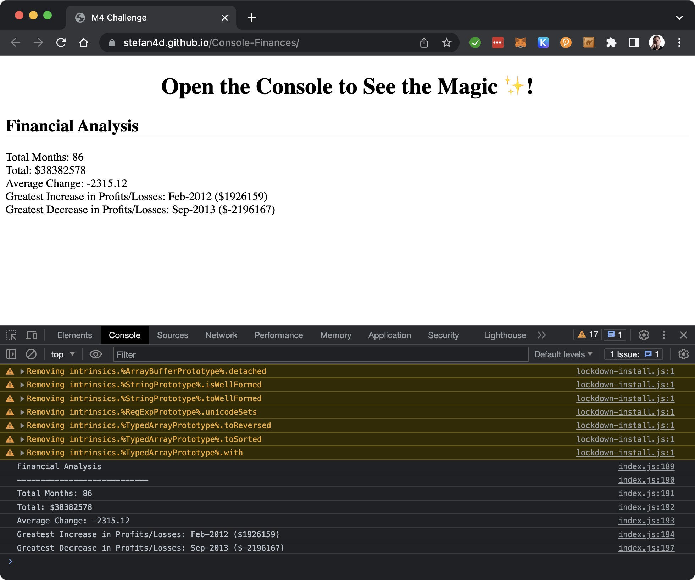

# Console Finances

## Description

Submission for Module 4 of the University of Birmingham Skills Bootcamp in Front-End Web Development &amp; UX.

This assignment took a starter code package in commit [5d978e9](https://github.com/Stefan4D/Console-Finances/commit/5d978e93b0a4541e0999f1c1513cb21bba09b2a1) and developed it to meet the defined acceptance criteria.

The production website is deployed [here](https://stefan4d.github.io/Console-Finances/).

This has been developed to meet the following Acceptance Criteria:

| Acceptance Criteria                                                                                                                                                                                                                                                                                                                                                                                                                                          | Solution                                                                                                |
| ------------------------------------------------------------------------------------------------------------------------------------------------------------------------------------------------------------------------------------------------------------------------------------------------------------------------------------------------------------------------------------------------------------------------------------------------------------ | ------------------------------------------------------------------------------------------------------- |
| Write JavaScript code that analyzes the records to calculate each of the following: 1. The total number of months included in the dataset. 2. The net total amount of Profit/Losses over the entire period. 3. The average of the changes in Profit/Losses over the entire period. 4. The greatest increase in profits (date and amount) over the entire period. 5. The greatest decrease in losses (date and amount) over the entire period. | Solution is detailed within `index.js` as comments including solution steps for more complicated logic. |

## Learning Outcome

- I learned the .toFixed() method for rounding numbers to a specific number of decimal places, as opposed to round(), floor(), or ceil() which round to integers.

- I practiced DOM manipulation by also inserting the calculated results into the main HTML document.

## Resources Used

In completing this challenge exercise, I made use of the following resources:

- [MDN Docs: Number .toFixed()](https://developer.mozilla.org/en-US/docs/Web/JavaScript/Reference/Global_Objects/Number/toFixed)

## Mark Scheme Compliance

### Technical Acceptance Criteria

| Item                                            | Evidence                                                                   |
| ----------------------------------------------- | -------------------------------------------------------------------------- |
| Satisfies all of the above acceptance criteria. | The built application satisfies the acceptance criteria, as set out above. |

### Deployment

| Item                                              | Evidence                                                                   |
| ------------------------------------------------- | -------------------------------------------------------------------------- |
| Application deployed at live URL.                 | Live application deployed at: https://stefan4d.github.io/Console-Finances/ |
| Application loads with no errors.                 | No visual defects   No console errors                                 |
| Application GitHub URL submitted.                 | URL submitted                                                              |
| GitHub repository that contains application code. | This repository contains all code.                                         |

### Application Quality

| Item                                                                                    | Evidence                                                                        |
| --------------------------------------------------------------------------------------- | ------------------------------------------------------------------------------- |
| Application resembles the mock-up functionality provided in the Challenge instructions. | Application resembles the mock-up and I have also added the output to the HTML. |

### Repository Quality

| Item                                                                                                    | Evidence                                                                                                                                                                                                                                                                                                                                                                                         |
| ------------------------------------------------------------------------------------------------------- | ------------------------------------------------------------------------------------------------------------------------------------------------------------------------------------------------------------------------------------------------------------------------------------------------------------------------------------------------------------------------------------------------ |
| Repository has a unique name.                                                                           | Unique name used                                                                                                                                                                                                                                                                                                                                                                                 |
| Repository follows best practices for file structure and naming conventions.                            | Standard file naming conventions used                                                                                                                                                                                                                                                                                                                                                            |
| Repository follows best practices for class/id naming conventions, indentation, quality comments, etc.  | All multi-word variables used camelCase and I have prepended an underscore to internal or private variables (were they in a function) e.g. \_tempVariable to indicate this should not be changed outside of the code block    Indentation within code follows best practice    Comments have been included within the files to describe behaviour and/or intent of the code. |
| Repository contains multiple descriptive commit messages.                                               | Multiple commits included demonstrating incremental build of final submission. Each has a clear description of changes made.                                                                                                                                                                                                                                                                     |
| Repository contains quality README file with description, screenshot, and link to deployed application. | This README document.                                                                                                                                                                                                                                                                                                                                                                            |

## License

Released under the MIT license. Full details in [LICENSE](./LICENSE).
